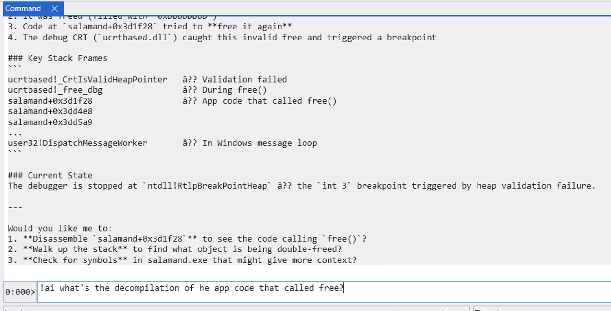
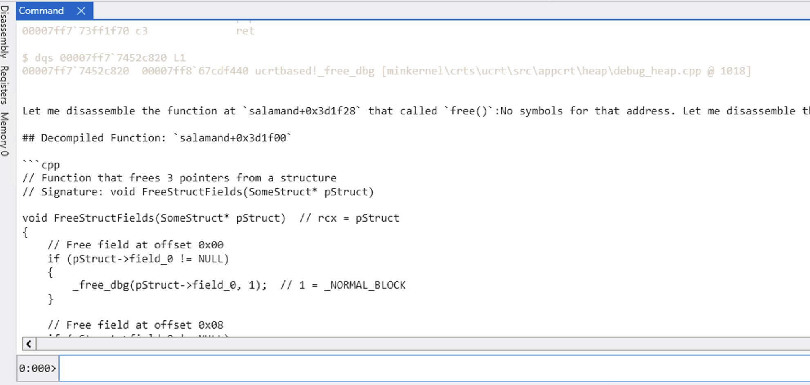
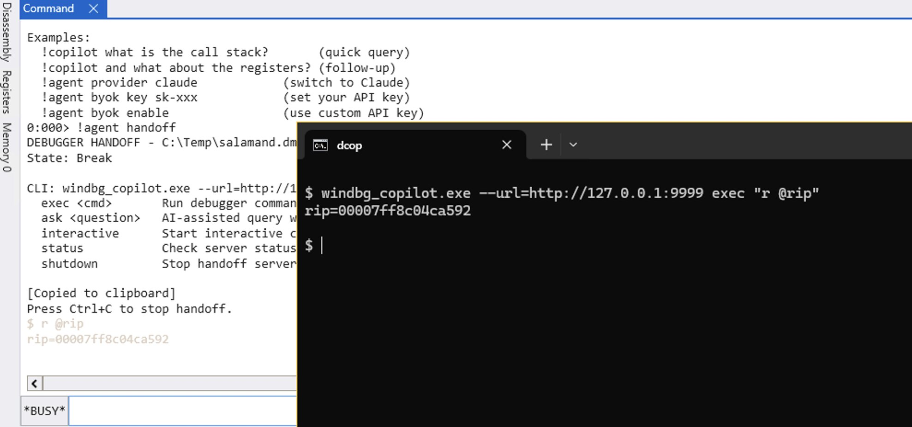

# WinDbg Copilot

GitHub Copilot powered debugging assistant for WinDbg. Ask questions about your debug session and get intelligent answers with automatic debugger command execution.

Supports multiple AI providers:
- **GitHub Copilot** - via [copilot-sdk-cpp](https://github.com/0xeb/copilot-sdk-cpp)
- **Claude** (Anthropic) - via [claude-agent-sdk-cpp](https://github.com/0xeb/claude-agent-sdk-cpp)

## Building

### Prerequisites
- Windows 10/11
- Visual Studio 2022 with C++ workload
- CMake 3.20+
- Windows SDK (for dbgeng.h)

### Build Steps

```bash
# Clone with submodules
git clone --recursive https://github.com/0xeb/windbg_copilot.git
cd windbg_copilot

# Configure and build
cmake -B build -S . -DCMAKE_BUILD_TYPE=Release
cmake --build build --config Release
```

The extension DLL will be at `build/Release/windbg_copilot.dll`.

## Usage

### Loading the Extension

1. Open WinDbg and load a dump file or attach to a process
2. Load the extension:

```
.load C:\path\to\windbg_copilot.dll
```

### Commands

| Command | Description |
|---------|-------------|
| `!agent help` | Show help |
| `!agent version` | Show version and current provider |
| `!agent provider` | Show current provider |
| `!agent provider <name>` | Switch provider (claude, copilot) |
| `!agent ask <question>` | Ask the AI a question |
| `!agent clear` | Clear conversation history |
| `!agent prompt` | Show current custom prompt |
| `!agent prompt <text>` | Set custom prompt (appended to system prompt) |
| `!agent prompt clear` | Clear custom prompt |
| `!agent handoff` | Start HTTP server for external tool integration |
| `!agent version prompt` | Show injected system prompt |
| `!copilot <question>` | Shorthand for `!agent ask` or `!ai` |

### Examples

```
# Ask about the current state
!copilot what is the call stack?
!copilot what is rax + rbx?

# Run commands directly - AI executes and explains
!copilot db @rip L20
!copilot !peb

# Decompilation
!copilot decompile ntdll!RtlAllocateHeap

# Follow-up questions (uses conversation history)
!copilot what about the registers?

# Ask for analysis
!copilot explain this crash

# Switch to Claude provider
!agent provider claude

# Set a custom prompt for your debugging session
!agent prompt Focus on memory corruption and heap issues

# Clear history and start fresh
!agent clear
```

### Handoff (External Tool Integration)

Let external AI agents control the debugger via HTTP:

```bash
# In WinDbg - start the handoff server
!agent handoff

# From another terminal - use the CLI tool
windbg_copilot.exe --url=http://127.0.0.1:9999 ask "what caused this crash?"
windbg_copilot.exe --url=http://127.0.0.1:9999 exec "kb"
windbg_copilot.exe --url=http://127.0.0.1:9999 interactive
windbg_copilot.exe --url=http://127.0.0.1:9999 status
windbg_copilot.exe --url=http://127.0.0.1:9999 shutdown
```

Settings are saved in `%USERPROFILE%\.windbg_copilot\settings.json`.

## Features

- **Direct command execution**: Pass debugger commands directly (`!ai db @rsp L10`) - AI runs and explains
- **Expression evaluation**: Uses `?`, `??`, `dx` for calculations instead of guessing
- **Decompilation**: Ask to decompile functions - AI uses `uf`, `dv`, `dt` to generate pseudocode
- **Automatic tool execution**: AI runs debugger commands to gather information
- **Conversation continuity**: Follow-up questions remember context
- **Session persistence**: Claude restores sessions across debugger restarts
- **Multiple providers**: Switch between Claude and Copilot
- **Handoff**: Let external AI agents (like Copilot or Claude Code) control the debugger

## Screenshots

### Debugging a Double-Free Bug

AI analyzes a heap corruption crash, identifies the root cause, and offers next steps:



User asks for decompilation — AI generates readable pseudocode from assembly:



### Handoff: External Tool Integration

Start `!agent handoff` to let external tools control WinDbg. The CLI executes commands remotely:



Claude Code (Opus 4.5) controlling WinDbg via handoff — analyzing a double-free crash:


## Author

Elias Bachaalany ([@0xeb](https://github.com/0xeb))

Pair-programmed with Claude Code and Codex.

## License

MIT
